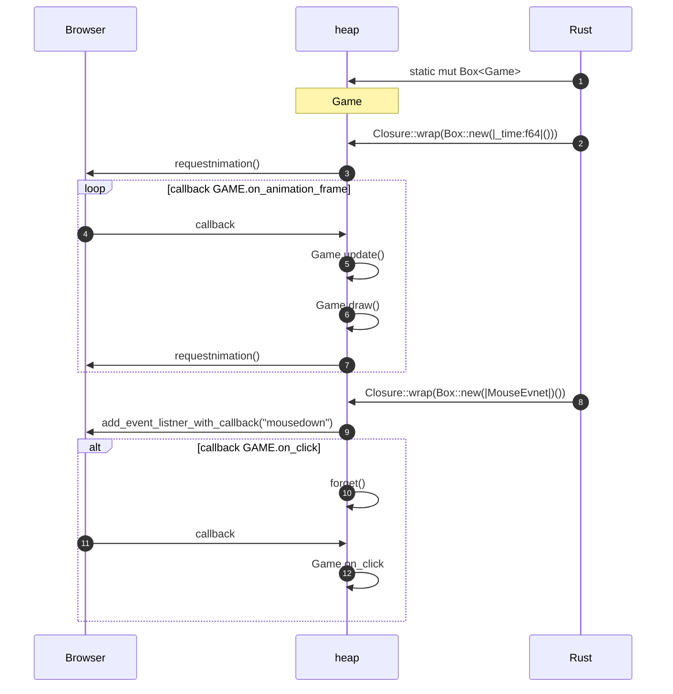

# demo01
Rust WebAssembly Demo
=======
demo01 🎨
========
Programming mini game for Demo in Rust & WebAssembly

[](https://myurioka.github.io/demo01/)

[Play in browser](https://myurioka.github.io/demo01)

### How to play (Control)

  * Click Circle: Get number and start

### Requirement
  * Rust, Cargo
  * WASM

### How to Build & Run

  ```sh
  $ cd demo01
  $ pnpm build-wasm
  $ pnpm dev --open
  ```
  Browse http://localhost:5173

### Sequence Diagram


<br>
<ol>
<li>Create Static mut Game Object👍</li>
<li>set interface function(closure) for requestAnimationFrame <br/> 👍RefCell< T > and the Interior Mutablilly Pattern<br/> After the first requestAnimationFrame call, the closure is disappointed</li>
<li>requestAnimationFrame(interface function for callback) in first</li>
<li>callback → Closure::wrap(Box::new(|_time:f64|())) 
<li>game update</li>
<li>game draw</li>
<li>requestAnimationFrame(interface function for callback) in loop</li>
<li>set interface function(closure) for MouseEvent at MouseDown</li>
<li>canvas.add_event_listener_with_callback("moudsedown")</li>
<li>forget() to keep interface function(closure)👍</li>
<li>MouseEvent(callback)</li>
<li>game set click position</li>
</ol>

