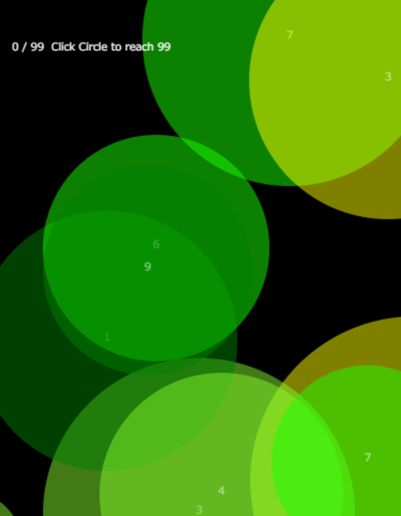
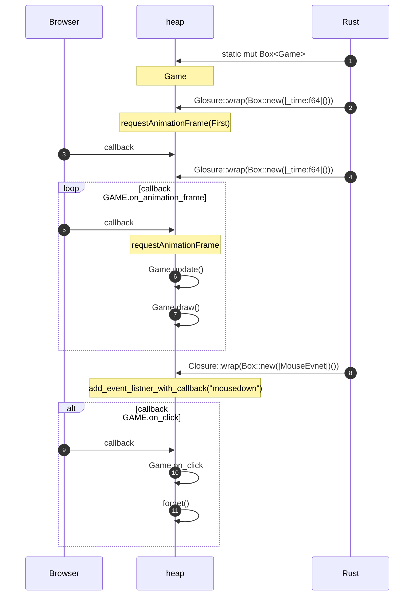

# demo01
Rust WebAssembly Demo
=======
demo01 🎨
========
Programming mini game for Demo in Rust & WebAssembly

[](https://myurioka.github.io/demo01/)

[Play in browser](https://myurioka.github.io/demo01)

### How to play (Control)

  * Click Circle: Get number and start

### Requirement
  * Rust, Cargo
  * WASM

### How to Build & Run

  ```sh
  $ cd demo01
  $ pnpm build-wasm
  $ pnpm dev --open
  ```
  Browse http://localhost:5173

### Sequence Diagram


<br>
<ol>
<li>Create Static mut Game Object</li>
<li>RefCell< T > and the Interior Mutablilly Pattern</li>
<li>reguestAnimationFrame(callback)</li>
</ol>

